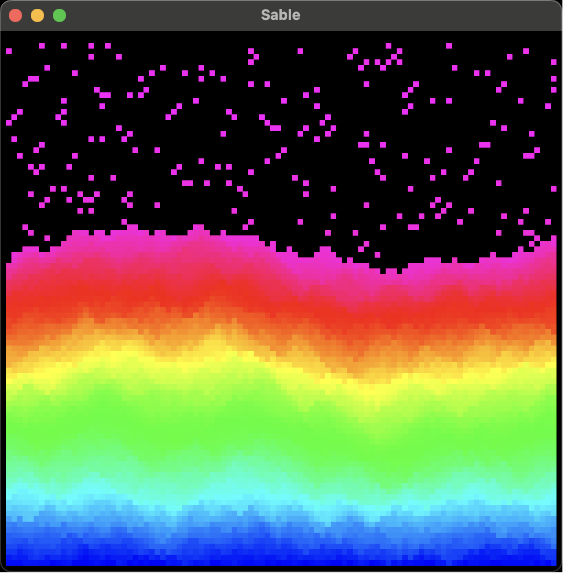
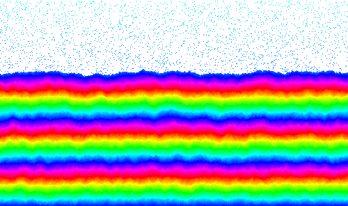

# Sable

Basic falling sand simulation. Sand grains fall according to three simple rules:

1. If the space below a grain is empty, fall straight down.

2. Otherwise, if the space below and left is empty, fall there. Otherwise, do the same for below and right. The priority between left and right can be randomly chosen.

3. Otherwise, remain in place.

## Running

The simulation can either run in real-time in a window, or as a one-shot. For the latter, this can either produce a BMP image, or write the final values to the terminal.

(In the examples below, custom flags are used but not shown. They can be inspected using the `--help` flag.)

```sh
$ sable realtime
```



```sh
$ sable bmp
```



```sh
$ sable terminal
0    4    4    4    3
4    4    3    2    2
3    3    2    2    1
2    1    1    1    1
```
